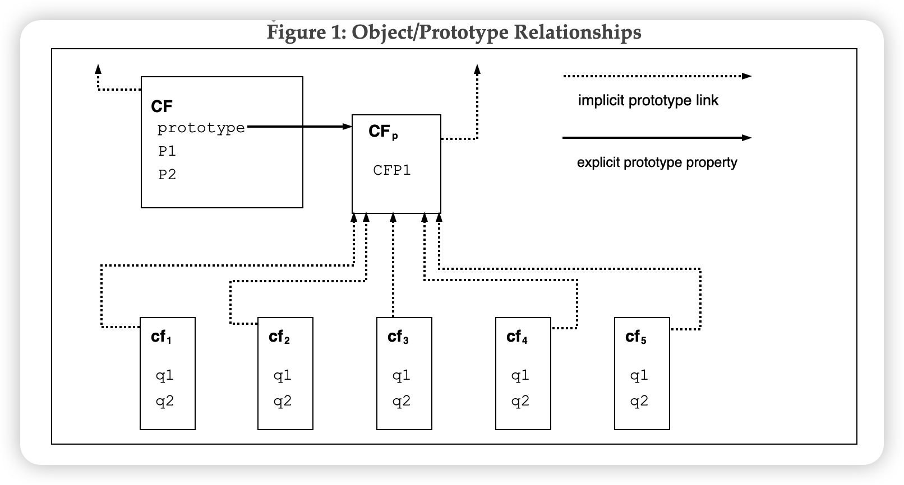

# 对象概述

虽然 ES 包含 class 的相关语法，但 ES 并不是和 Java、C++、SmallTalk 这种语言一样是基于类的，相反可以通过各种方式创建对象，例如字面量或使用构造函数。

使用 `new` 关键字执行构造函数派生出该构造函数的实例。每个构造函数都是一个函数，使用 prototype 来实现基于原型的继承和共享属性。

构造函数创建的每一个对象都对其构造函数的 prototype 属性有**隐式引用**（称为该对象的原型）。此外，prototype 可能对其原型也有非空的隐式引用，以此类推。这称为原型链。在查找某个对象中属性时，会现从自身开始查找，然后从原型链上开始查找。

在基于 class 的面向对象语言中，一般情况下，状态由实例承载，方法由类承载，继承只是结构和行为。在 ES 中，状态和方法由对象携带，而结构、行为都是继承的。

CF 是一个构造函数（也是一个对象），使用 new 派生出对象 `cf1 → cf5`

这些对象都包含 `q1` 和 `q2` 属性。虚线表示隐式原型关系，例如 cf3 的隐式原型是 CFp

构造函数 CF 有 `P1` 和 `P2` 两个属性，这两个属性对 CFp 和 cf1 ~ cf5 均不可见。CFp 有属性 `CFP1` ，可以被共享。CF 与 CFp 是显式原型关系。

与大多数基于 class 的语言不同，可以给对象赋值来动态将属性添加到对象中。例如可以为 `CFp` 对象动态赋值来为 `cf1 -> cf5` 添加新的共享属性。

尽管 ES 不是天生基于 class 的，但可以通过构造函数和原型很方便的定义类似类的抽象结构。ES 的一些内置对象本身遵循一个这样类似类的模式。从 ES 2015 开始，ES 语法包含了 class 关键字，允许程序员简洁定义符合内置对象使用的类抽象模式。